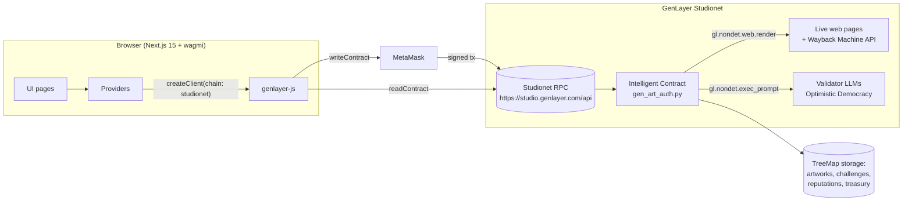
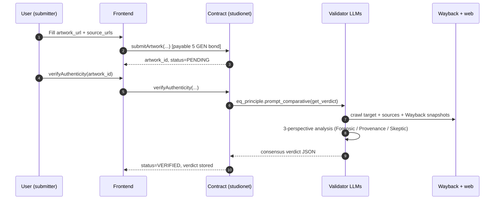
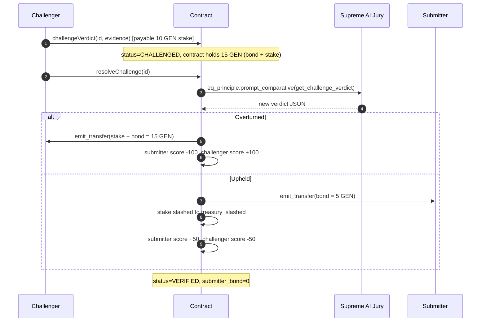

# GenArtAuth — Architecture

This document describes the on-chain and off-chain components of GenArtAuth after the **Trust Layer v1** upgrade.

## Component overview

## Verification lifecycle

## Dispute lifecycle

## Storage layout

| Field | Type | Purpose |
|---|---|---|
| `artworks` | `TreeMap[str, Artwork]` | Primary registry keyed by decimal id |
| `artwork_url_to_id` | `TreeMap[str, str]` | Reverse index for double-submit prevention |
| `challenges` | `TreeMap[str, Challenge]` | One active challenge per artwork_id |
| `reputations` | `TreeMap[str, Reputation]` | Score + counters keyed by lowercased `0x…` |
| `next_artwork_id` | `str` | Auto-incrementing decimal id |
| `min_challenge_stake` | `u256` | 10 GEN floor at `challengeVerdict` |
| `min_submitter_bond` | `u256` | 5 GEN floor at `submitArtwork` |
| `treasury_slashed` | `u256` | Cumulative GEN slashed from failed challenges |

All TreeMap keys are `str` to stay safe at the calldata boundary (see rule R19 in `~GEN_RULES/02-common-errors.md`).

## Non-determinism boundary

Every `gl.nondet.web.render` and `gl.nondet.exec_prompt` call runs inside a closure passed to `gl.eq_principle.prompt_comparative`. Storage is read **outside** the closure and captured by reference — the closure never touches `self.*` directly.

The equivalence principle instructs validator LLMs to:

- Match `verdict` (ORIGINAL vs COPY).
- Match `action` (MINT_SAFE vs BLOCK_MINT).
- Allow `confidence` to differ by at most 15.
- Require the `reason` to explicitly cover Forensic + Provenance + Skeptic perspectives.

## Trust Layer v1 additions

- **Reputation**: `Reputation` struct + four scoring helpers exposed through `getReputation(address_str)`.
- **Multi-perspective prompt**: `_verify` now mirrors `_verify_challenge` by demanding an explicit three-perspective synthesis.
- **Prompt-injection canary**: `_CANARY_SENTINEL` is quoted in every prompt with a do-not-echo directive; `_detect_injection` raises on any leak in the output.
- **`_addr_str` R20 wrapper**: `Address.as_hex` is version-fragile; the wrapper falls back to `str(addr)` and normalises casing.
- **Self-challenge guard**: `challengeVerdict` rejects `sender == submitter` to prevent stake-farming with one's own bond.
- **`treasury_slashed`**: cumulative counter for slashed stakes, exposed via `getTreasuryBalance`.
